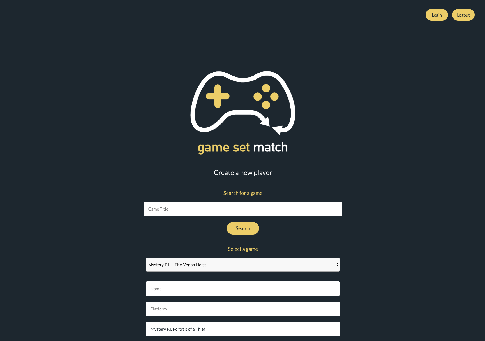
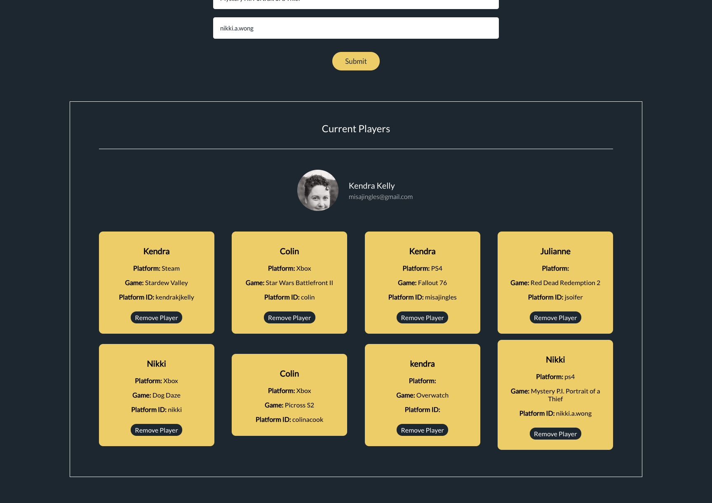

# **Game Set Match**

#### _A matching service for lonely gamers., 12.12.2018_

###### By Colin Cook, Nikki Wong, Kendra Kelly & Julianne Soifer

## Description

Just got a new game and looking for someone to play? Need some more players on your team? You can create a profile and get matched up with other players.

## Images

##### _Login Screen_

##### _Game Search & Create Player Form_

##### _Player Card List_

## Setup/Installation Requirements

Clone this repository to your Desktop and run the following command in the terminal

### `npm install`

## Available Scripts

In the project directory, you can run:

### `npm start`

Runs the app in the development mode. 
Open [http://localhost:3000](http://localhost:3000) to view it in the browser.

The page will reload if you make edits. 
You will also see any lint errors in the console.

### `npm test`

Launches the test runner in the interactive watch mode. 
See the section about [running tests](https://facebook.github.io/create-react-app/docs/running-tests) for more information.

### `npm run build`

Builds the app for production to the `build` folder. 
It correctly bundles React in production mode and optimizes the build for the best performance.

The build is minified and the filenames include the hashes. 
Your app is ready to be deployed!

See the section about [deployment](https://facebook.github.io/create-react-app/docs/deployment) for more information.

## Technologies Used

* NPM
* Sass
* React
* Redux
* Create react app
* Firebase

## Support and contact details

We would love to hear from you! If you have any issues with this application or have any suggestions on how it could be improved, please let us know.

Contact us at [ccook987@gmail.com](mailto:ccook987@gmail.com)

### License

This software is licensed under the MIT license.

Copyright (c) 2018 Colin Cook, Nikki Wong, Kendra Kelly, Julianne Soifer
